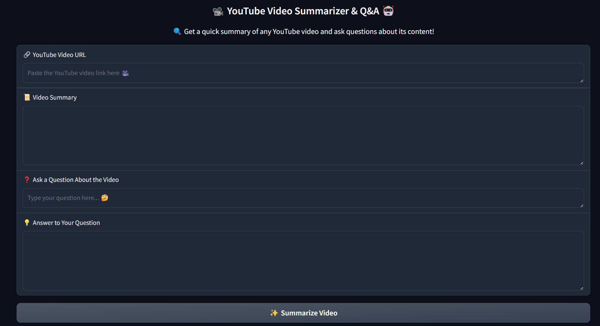
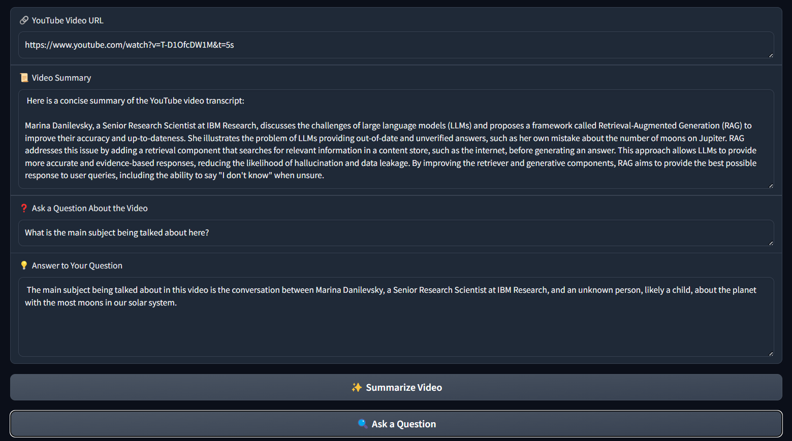

# 🎬 YouTube Video Transcript Summarizer & Q&A Bot 🚀

## 📌 Overview
This project extracts transcripts from YouTube videos, processes them into chunks, and utilizes IBM WatsonX AI to generate summaries and answer user queries efficiently. 💡🔍

## ✨ Features
- 🔗 **Extracts YouTube Video Transcripts** (Manually created preferred over auto-generated)
- 📝 **Splits transcripts into manageable chunks** using LangChain
- 🤖 **Utilizes IBM WatsonX AI** for LLM and embeddings
- 🔍 **Performs similarity searches** using FAISS for efficient retrieval
- 📝 **Summarizes video content** concisely and effectively
- ❓ **Answers user questions** based on video content

---

## 🏗️ Installation

### 1️⃣ Clone the Repository
```bash
git clone https://github.com/your-repo.git
cd your-repo
```

### 2️⃣ Install Dependencies
```bash
pip install -r requirements.txt
```

### 3️⃣ Set Up IBM WatsonX Credentials
Ensure you have your API credentials and update the `setup_credentials` function with your WatsonX service URL and project ID.

---

## 🔧 Usage

### 🎥 Extract Transcript from YouTube
```python
transcript = get_transcript("https://www.youtube.com/watch?v=VIDEO_ID")
```

### ✂️ Process and Chunk the Transcript
```python
processed_transcript = process(transcript)
chunks = chunk_transcript(processed_transcript)
```

### 🧠 Setup WatsonX Model & FAISS Index
```python
model_id, credentials, client, project_id = setup_credentials()
parameters = define_parameters()
llm = initialize_watsonx_llm(model_id, credentials, project_id, parameters)
embedding_model = setup_embedding_model(credentials, project_id)
faiss_index = create_faiss_index(chunks, embedding_model)
```

### 📝 Summarize Video Content
```python
summary_prompt = create_summary_prompt()
summary_chain = create_summary_chain(llm, summary_prompt)
summary = summary_chain.run(transcript)
print(summary)
```

### ❓ Ask Questions Based on Video Content
```python
qa_prompt_template = create_qa_prompt_template()
qa_chain = create_qa_chain(llm, qa_prompt_template)
question = "What is the main topic discussed in the video?"
answer = generate_answer(question, faiss_index, qa_chain)
print(answer)
```
---

### 🖼️ Screenshots






---

## 📌 Technologies Used
- 🐍 Python
- 🛠️ IBM WatsonX AI (LLM & Embeddings)
- 📄 LangChain (Text Processing)
- 🔍 FAISS (Vector Search & Similarity)
- 🎥 YouTube Transcript API

---

## 📌 Contributing 🤝
Pull requests are welcome! Feel free to suggest improvements or add new features. 🚀

---

## 📜 License
This project is licensed under the MIT License. 📜

---

🎯 **Happy Coding!** 🚀
